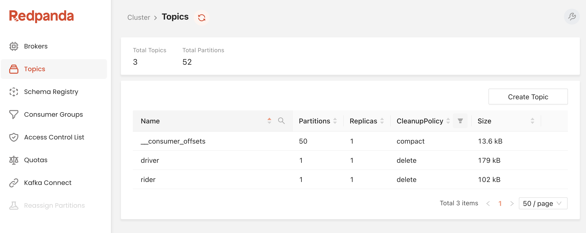
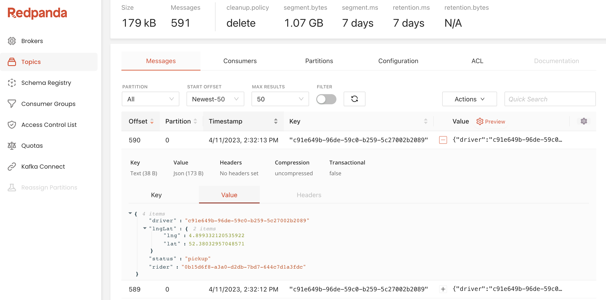

= kafkazavr

How to use Kotlin and Ktor to build applications which share geographical coordinates.

== Map functionality

NOTE: Get Mapbox API key https://account.mapbox.com/access-tokens/create

== Run Rider and Driver apps separately

Add command line argument:

* For driver app: -config=src/main/resources/driver.conf
* For rider app: -config=src/main/resources/rider.conf

To run both modules in the same application, just run as usual, without `-config`.
In this case, `application.conf` will be used

[source,bash]
.Run Rider and Driver apps separately
----
./gradlew build #<1>
java -cp build/libs/org.kafkainaction.klyft-all.jar io.kafkazavr.ApplicationKt -config=src/main/resources/driver.conf #<2>
java -cp build/libs/org.kafkainaction.klyft-all.jar io.kafkazavr.ApplicationKt -config=src/main/resources/rider.conf  #<3>

# or same with Gradle application plugin
./gradlew run --args="-config=src/main/resources/driver.conf" #<2>
./gradlew run --args="-config=src/main/resources/rider.conf"  #<3>
----
<1> build shadow jar
<2> run driver app
<3> run rider app

== Kafka

[source,bash]
.docker stuff
----
# TODO: replace with TC
./gradlew composeUp    #<1>
docker exec -it broker /usr/bin/kafka-topics --bootstrap-server broker:9092 --list    #<2>

docker exec -it broker /usr/bin/kafka-console-consumer --topic driver --bootstrap-server broker:9092 --property print.key=true --from-beginning #<3>
docker exec -it broker /usr/bin/kafka-console-consumer --topic rider --bootstrap-server broker:9092 --property print.key=true --from-beginning #<4>
----
<1> start zk and ak
<2> check if everything is there
<3> read driver topic
<4> read rider topic

Open browser at http://localhost:9080 for Redpanda Kafka Console

.Check if rider and driver topics are there 

.Check if data streams through driver(rider) topics

